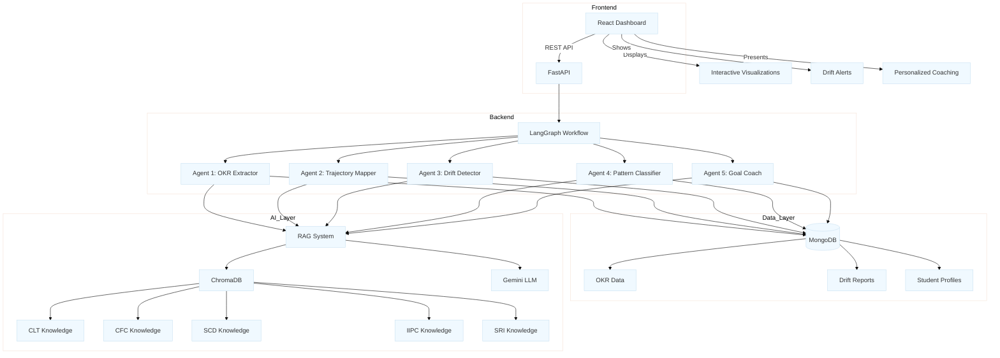
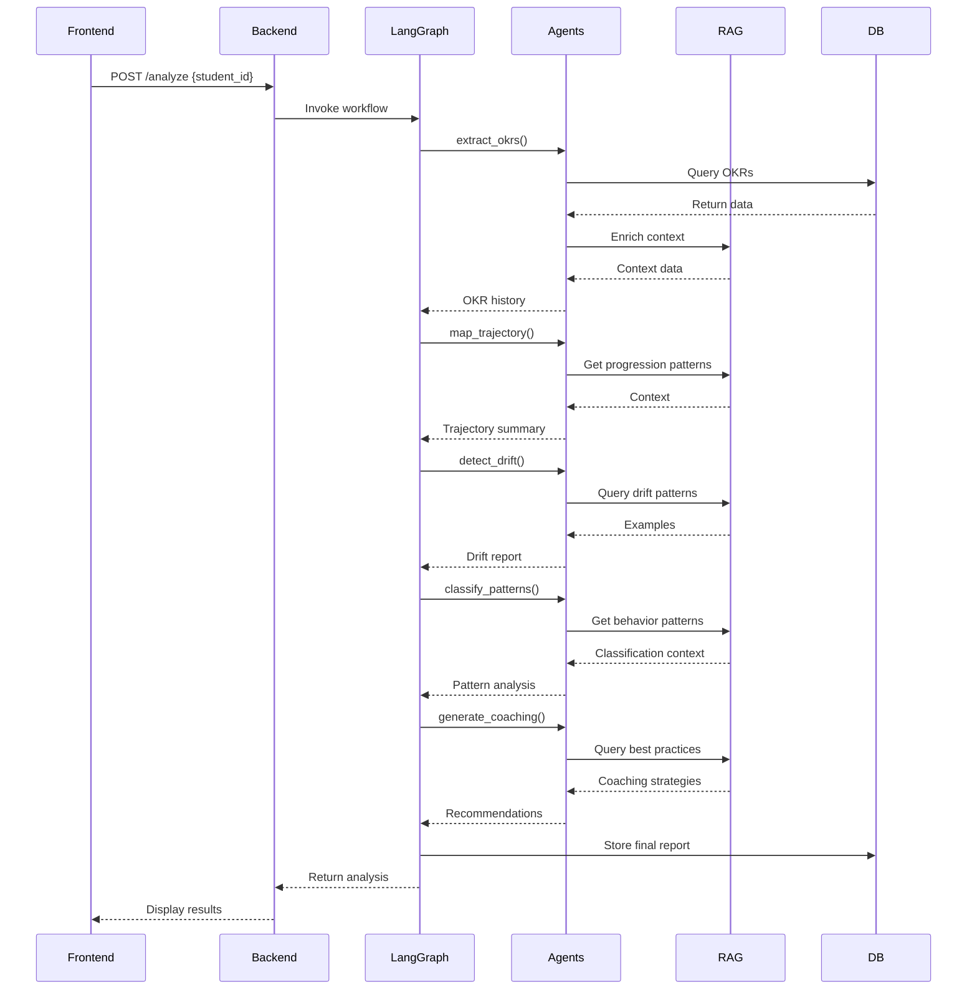
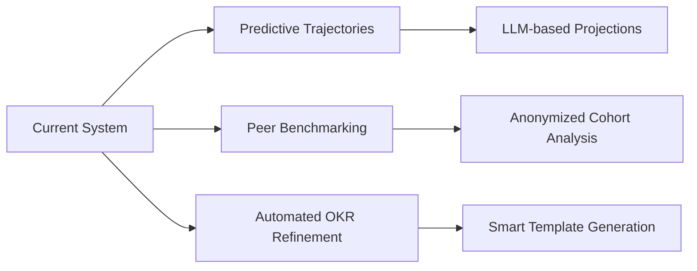

# OKR Goal-Drift Detection System - Comprehensive README

## Table of Contents
1. [System Overview](#system-overview)
2. [Core Architecture](#core-architecture)
3. [RAG Implementation](#rag-implementation)
4. [LangGraph Workflow](#langgraph-workflow)
5. [Agent Details](#agent-details)
6. [Data Flow](#data-flow)
7. [Setup Guide](#setup-guide)
8. [Testing & Validation](#testing--validation)
9. [Future Enhancements](#future-enhancements)

## System Overview

The Agentic AI-Based Goal-Drift Detector is a sophisticated multi-agent system that leverages Retrieval-Augmented Generation (RAG) and LangGraph orchestration to analyze student OKRs across multiple cycles. The system identifies goal trajectories, detects drift patterns, and provides personalized coaching recommendations through five specialized agents working in concert.

## Core Architecture



## RAG Implementation

### Architecture Components

1. **Knowledge Base**:
   - ChromaDB vector stores for each of the 5 pillars (CLT, CFC, SCD, IIPC, SRI)
   - Pre-loaded with domain-specific content:
     ```python
     # Example from rag_utils.py
     clt_data = [{
         "content": "GenAI courses on PrepInsta platform...",
         "metadata": {"pillar": "CLT", "type": "course", "domain": "GenAI"}
     }]
     ```

2. **Embedding Pipeline**:
   - Uses Gemini embeddings (fallback to default)
   - Document chunking and vectorization during initialization
   ```python
   self.embedding_function = embedding_functions.GoogleGenerativeAiEmbeddingFunction(
       api_key=os.getenv("GEMINI_API_KEY")
   )
   ```

3. **Retrieval Process**:
   - Context-aware querying across pillars
   ```python
   def query_pillar_knowledge(self, pillar: str, query: str, k: int = 5):
       results = self.collections[pillar].query(
           query_texts=[query],
           n_results=k
       )
       return [{"content": doc, "metadata": meta} 
               for doc, meta in zip(results['documents'][0], results['metadatas'][0])]
   ```

4. **Generation Process**:
   - Gemini 1.5 Flash model for response generation
   - Context injection into prompts:
   ```python
   async def generate_with_context(self, prompt: str, context: List[Dict] = None):
       if context:
           context_text = "\n".join([
               f"Context: {item['content']}\nMetadata: {item['metadata']}"
               for item in context
           ])
           full_prompt = f"Context Information:\n{context_text}\n\nQuery: {prompt}"
       else:
           full_prompt = prompt
       
       response = await self.model.generate_content_async(full_prompt)
       return response.text
   ```

### Knowledge Base Contents

| Pillar | Sample Content | Metadata Tags |
|--------|----------------|---------------|
| CLT | GenAI courses, Product Management certs | `course`, `platform`, `hours` |
| CFC | Hackathon guidelines, YC company profiles | `hackathon`, `team_size`, `stage` |
| SCD | LeetCode strategies, exam patterns | `problem_type`, `difficulty`, `exam` |
| IIPC | Networking templates, article examples | `platform`, `hashtags`, `connection_type` |
| SRI | DT workshop formats, impact metrics | `activity_type`, `team_size`, `duration` |

## LangGraph Workflow

### State Management

```python
class AgentState(BaseModel):
    student_id: str
    okr_history: List[Dict[str, Any]] = []
    trajectory_summary: str = ""
    drift_report: Dict[str, Any] = {}
    pattern_classification: str = ""
    coaching_recommendations: List[str] = []
    analysis_timestamp: datetime = None
```

### Graph Definition

```python
def create_agent_workflow(self):
    workflow = StateGraph(AgentState)
    
    # Add nodes for each agent
    workflow.add_node("extract_okrs", extract_okrs_node)
    workflow.add_node("map_trajectory", map_trajectory_node)
    workflow.add_node("detect_drift", detect_drift_node)
    workflow.add_node("classify_patterns", classify_patterns_node)
    workflow.add_node("generate_coaching", generate_coaching_node)
    
    # Linear workflow edges
    workflow.add_edge("extract_okrs", "map_trajectory")
    workflow.add_edge("map_trajectory", "detect_drift")
    workflow.add_edge("detect_drift", "classify_patterns")
    workflow.add_edge("classify_patterns", "generate_coaching")
    workflow.add_edge("generate_coaching", END)
    
    workflow.set_entry_point("extract_okrs")
    self.app = workflow.compile()
```

### Execution Flow



## Agent Details

### 1. OKR Extractor Agent

**Key Features**:
- Handles missing data with sample generation
- Pillar-specific context enrichment
- Temporal filtering by cycles

**Data Flow**:
1. Query MongoDB for historical OKRs
2. For each OKR:
   - Retrieve relevant pillar knowledge
   - Attach context to OKR object
3. Return enriched OKR set

### 2. Trajectory Mapper Agent

**Analysis Dimensions**:
1. Skill progression continuity
2. Cross-pillar synergy
3. Depth vs. breadth balance
4. Career alignment

**Prompt Engineering**:
```python
"""
Analyze OKR progression considering:
1. CLT: Learning path coherence
2. CFC: Project evolution
3. SCD: Skill stacking
4. IIPC: Network growth
5. SRI: Impact scaling

Identify 2-3 sentence trajectory pattern focusing on:
- Dominant themes
- Progression logic
- Strategic gaps
"""
```

### 3. Drift Detector Agent

**Detection Criteria**:
- Sudden pillar switches (>2 standard deviations from peer norm)
- Abandoned skill paths (completed <30% with no follow-up)
- Contradictory objectives (e.g., deep specialization vs. broad exploration)
- Pillar imbalance (neglecting core areas >2 cycles)

**Output Structure**:
```json
{
  "drift_level": "Medium",
  "flagged_transitions": [
    {
      "from": "GenAI Course",
      "to": "Digital Art", 
      "reason": "No connecting skills or stated rationale"
    }
  ],
  "reasoning": "Student shows exploration but lacks..."
}
```

### 4. Pattern Classifier Agent

**Classification Taxonomy**:
1. **Strategic Patterns**:
   - Iterative Refinement
   - Multi-Pillar Integration
   - Strategic Pivot

2. **Risk Patterns**:
   - Shiny Object Syndrome
   - Scattered Approach
   - Depth Avoidance

**Evidence Requirements**:
- Minimum 2 cycles demonstrating pattern
- At least 3 supporting data points
- Cross-pillar consistency checks

### 5. Goal Coach Agent

**Recommendation Framework**:
1. **Corrective Actions** (address drift)
2. **Amplification Actions** (leverage strengths) 
3. **Connective Actions** (cross-pillar synergy)
4. **Progressive Actions** (next-level challenges)

**Output Example**:
```markdown
1. [CFC] Join AI-focused hackathon (DevPost) to apply CLT GenAI skills  
   - Team: 3-5 members | Deadline: Next month  
   - Success: Working prototype + pitch  

2. [CLT] Advanced NLP course (EdX) to deepen AI specialization  
   - Commitment: 10 hrs/month  
   - Deliverable: Technical blog post  
```

## Setup Guide

### 1. Infrastructure Requirements

```bash
# System Requirements
Python 3.9+
Node.js 16+
MongoDB 5.0+
ChromaDB running locally

# Memory Requirements
Minimum: 8GB RAM (16GB recommended)
Storage: 10GB free space
```

### 2. Backend Configuration

```bash
# Environment Variables (.env)
GEMINI_API_KEY=your_key_here
CHROMA_PERSIST_DIRECTORY=./chroma_data
MONGODB_URI=mongodb://localhost:27017

# Initialization Steps
python -m pip install -r requirements.txt
python db_init.py  # Sample data
uvicorn main:app --reload
```

### 3. Frontend Configuration

```bash
# Environment Variables (.env.local)
VITE_API_BASE=http://localhost:8000

# Startup
npm install
npm run dev
```

### 4. Knowledge Base Population

```python
# Custom data loading (add to rag_utils.py)
async def add_custom_knowledge(self, pillar: str, documents: List[Dict]):
    """Add organization-specific content"""
    docs = [d["content"] for d in documents]
    metas = [d["metadata"] for d in documents]
    ids = [f"custom_{pillar}_{i}" for i in range(len(docs))]
    
    self.collections[pillar].add(
        documents=docs,
        metadatas=metas,
        ids=ids
    )
```

## Testing & Validation

### 1. Unit Tests

```python
# Example test case for drift detection
async def test_drift_detection():
    agent = DriftDetectorAgent()
    test_case = {
        "trajectory_summary": "Switched from AI to design",
        "okr_history": [...] 
    }
    
    result = await agent.detect_drift(**test_case)
    assert "drift_level" in result
    assert result["flagged_transitions"][0]["reason"] != ""
```

### 2. Validation Metrics

| Agent | Metric | Target |
|-------|--------|--------|
| Extractor | Field Completion | >95% |
| Trajectory | Theme Accuracy | 90% |
| Drift | Flag Precision | 85% |
| Pattern | Classification F1 | 0.82 |
| Coach | Actionability Score | 4.5/5 |

### 3. Sample Test Cases

1. **Progressive Specialization**:
   - Input: 3 cycles of deepening AI focus
   - Expected: "Iterative Refinement" pattern

2. **Random Switching**:
   - Input: Unconnected OKRs across domains
   - Expected: "Scattered Approach" with high drift

3. **Strategic Pivot**:
   - Input: AI → Climate Tech with rationale
   - Expected: Medium drift, "Strategic Pivot" pattern

## Future Enhancements

### 1. Advanced Features



### 2. Integration Roadmap

1. **Learning Platforms**:
   - Direct OKR sync from Coursera/EdX
   - Automated completion verification

2. **Career Services**:
   - Resume gap detection
   - Interview prep alignment

3. **Advisor Portal**:
   - Cohort-level analytics
   - Early warning system

### 3. Performance Optimization

- **RAG**:
  - Hybrid retrieval (vector + lexical)
  - Dynamic chunk sizing
  - Cache frequently accessed contexts

- **LangGraph**:
  - Conditional branching
  - Parallel node execution
  - Error recovery flows

This comprehensive architecture leverages cutting-edge AI techniques while maintaining modularity for future enhancements. The combination of RAG for contextual understanding and LangGraph for orchestrated workflows creates a robust system for personalized student development tracking.