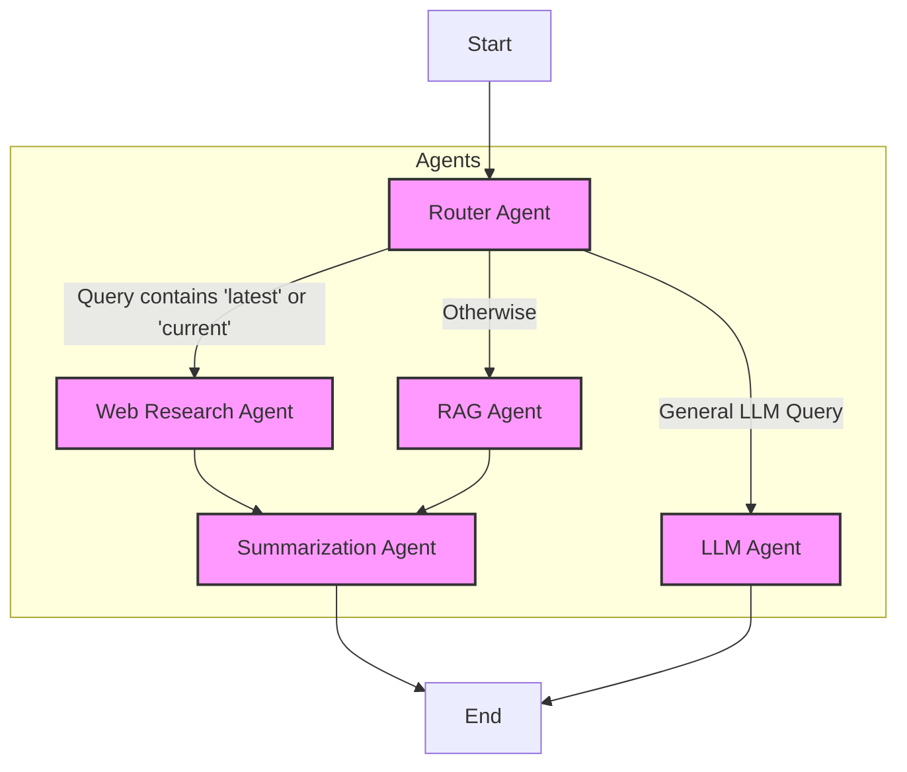

# Multi-Agent Research and Summarization System

This project implements a multi-agent research and summarization system using LangGraph. The system is designed to process user queries by intelligently routing them to specialized sub-agents based on the nature of the query (requiring LLM reasoning, web research, or retrieval from a knowledge base). The gathered information is then synthesized into a well-structured response.

## Problem Statement

The goal is to create a research and summarization agent that can process user queries and leverage multiple specialized sub-agents to generate well-structured responses.

## System Components

The system comprises the following specialized agents:

1.  **Router Agent**: Determines whether a query should be answered using a general LLM, web research, or Retrieval-Augmented Generation (RAG) from a predefined knowledge base.
2.  **Web Research Agent**: If the query requires up-to-date information, this agent performs a web search and extracts relevant details. (Note: Currently uses a placeholder for web search functionality).
3.  **RAG Agent**: If the query is related to a predefined dataset, this agent retrieves information from a vector database. (Note: Currently uses a placeholder for RAG functionality).
4.  **Summarization Agent**: After gathering information from the Web Research Agent or RAG Agent, this agent synthesizes a final structured response using an LLM.
5.  **LLM Agent**: Handles general queries and reasoning tasks that do not require specialized web research or RAG.

## Architecture and Workflow

The system is built using LangGraph to define a state graph with multiple nodes representing the different agents. Conditional edges are used to route the query to the appropriate agent based on the type of question.

**Workflow:**

1.  A user query enters the **Router Agent**.
2.  The **Router Agent** analyzes the query. For simplicity, if the query contains keywords like 'latest' or 'current', it routes to the **Web Research Agent**. Otherwise, it routes to the **RAG Agent**.
3.  If routed to **Web Research Agent**, it performs a web search (placeholder) and updates the state with the research results.
4.  If routed to **RAG Agent**, it retrieves information from a knowledge base (placeholder) and updates the state with the RAG results.
5.  After web research or RAG, the query proceeds to the **Summarization Agent**, which synthesizes a final response.
6.  If the query does not match the criteria for web research or RAG (e.g., a general knowledge question), it is routed to the **LLM Agent** which directly answers the query.



## Setup and Installation

1.  Clone the repository:
    ```bash
    git clone <repository-url>
    cd Multi_Agent_Research_System
    ```
2.  Create a virtual environment (optional but recommended):
    ```bash
    python -m venv venv
    source venv/bin/activate  # On Windows: `venv\Scripts\activate`
    ```
3.  Install the required dependencies:
    ```bash
    pip install -r requirements.txt
    ```
4.  Set up your Google Gemini API key. Create a `.env` file in the `Multi_Agent_Research_System` directory and add your API key:
    ```
    GEMINI_API_KEY="your_gemini_api_key_here"
    TAVILY_API_KEY="your_tavily_api_key_here"
    ```

## How to Run

To run the agent, execute the `agent.py` script:

```bash
python agent.py
```

The script includes example usage with predefined queries.

## Test Queries and Results

Here are some example queries and their expected behavior:

### Query 1: "Latest news on AI"

**Expected Workflow:** Router Agent -> Web Research Agent -> Summarization Agent

**Output (example):**
```
--- Query: Latest news on AI ---
Performing web research...
Summarizing information...
[Synthesized response based on web search results for 'Latest news on AI']
```

### Query 2: "What is the capital of France?"

**Expected Workflow:** Router Agent -> RAG Agent -> Summarization Agent

**Output (example):**
```
--- Query: What is the capital of France? ---
Retrieving from knowledge base...
Summarizing information...
[Synthesized response based on knowledge base retrieval for 'What is the capital of France?']
```

## Knowledge Base

The RAG Agent retrieves information from `knowledge_base.txt`. This file contains simple facts:

*   "The capital of France is Paris."
*   "Mount Everest is the highest mountain in the world."
*   "The Eiffel Tower is located in Paris, France."
*   "Artificial intelligence (AI) is a rapidly developing field."

## Future Improvements

*   Implement a proper vector database for the RAG Agent with actual, larger datasets.
*   Enhance the Router Agent's logic for more sophisticated query analysis and routing.
*   Add memory to the system for conversational AI capabilities. 